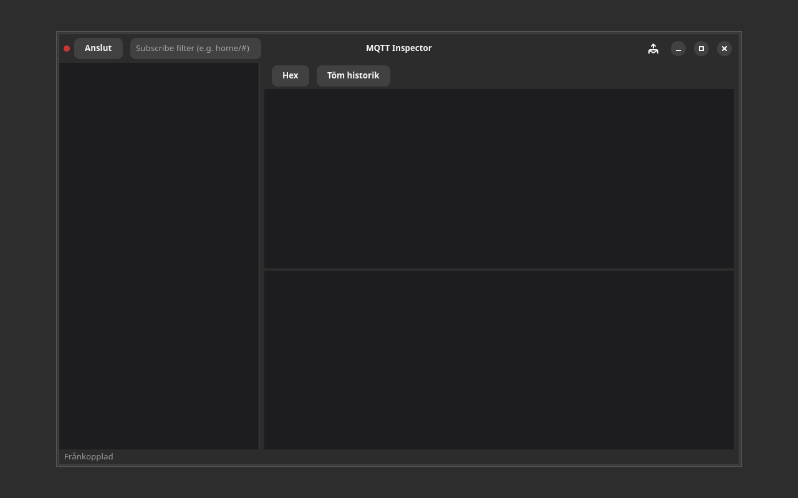

# ULMQTT message inspector for IoT

[](https://github.com/yeager/mqtt-inspector/releases)

## Screenshot



[](https://www.gnu.org/licenses/gpl-3.0)
[](https://www.transifex.com/danielnylander/mqtt-inspector/)

MQTT message inspector for IoT - a modern GTK4/Libadwaita application.

## Features

- Modern GTK4/Libadwaita interface
- Multi-language support via Transifex
- Keyboard shortcuts support
- Cross-platform compatibility

## Installation

### From Source
```bash
git clone https://github.com/yeager/mqtt-inspector.git
cd mqtt-inspector
pip install -e .
```

### Debian/Ubuntu
Download the latest `.deb` package from the [releases page](https://github.com/yeager/mqtt-inspector/releases).

### Fedora/RHEL
Download the latest `.rpm` package from the [releases page](https://github.com/yeager/mqtt-inspector/releases).

## Usage

Launch the application:
```bash
mqtt-inspector
```

### Keyboard Shortcuts
- `Ctrl+Q` - Quit application
- `F5` - Refresh data
- `Ctrl+?` - Show keyboard shortcuts

## Translation

Help translate this application on [Transifex](https://www.transifex.com/danielnylander/mqtt-inspector/).

## Author

**Daniel Nylander**
- Email: daniel@danielnylander.se
- GitHub: [@yeager](https://github.com/yeager)

## License

This project is licensed under the GPL-3.0-or-later License - see the [LICENSE](LICENSE) file for details.
